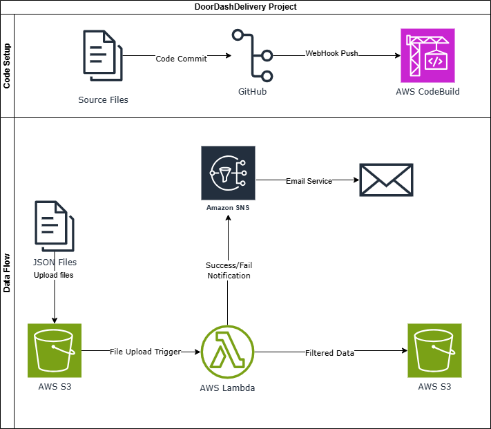

# DoorDashDelivery_Data
processing daily delivery data from DoorDash. JSON files containing delivery records 

## Overview
AWS based solution for processing daily delivery data from DoorDash.

## Assumptions & Data Flow
Here are the basic assumptions for the project
1.JSON files containing delivery records will be uploaded to an **Amazon S3 bucket**.
2.An **AWS Lambda** function will be triggered by the file upload.
3.The Lambda function will filter the records based on delivery status.
4.Filtered data is sent to another S3 Bucket.
5.Notifications regarding the processing outcome will be sent via **Amazon SNS**

## Tech Stack
* AWS Lambda
* Amazon SNS
* AWS CodeBuild (for CI/CD)
* GitHub (for Version Control)
* Python (Pandas)

## Project Design

